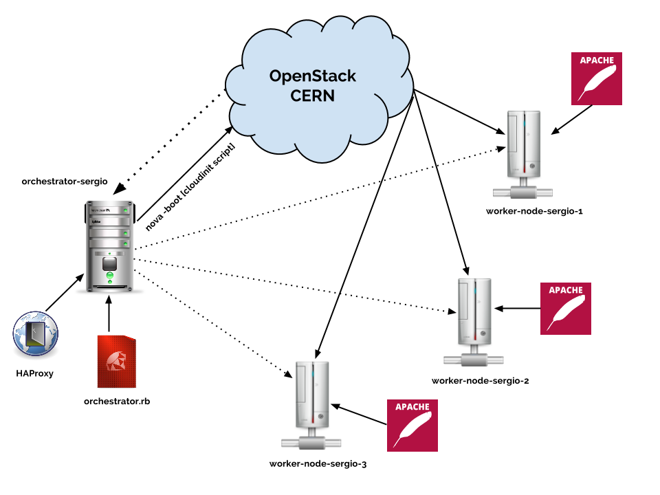

CloudOrchestrator
=================

**CloudOrchestrator** is a final assignment for the OpenStack Conference given by Ramón Medrano at University of Oviedo during the course: Software Architectures and Language Processing (*Master in Web Engineering*).

The goal of this project is to create a (**simple**) software able to interact with the CERN's OpenStack infrastructure by managing several virtual machines through the OpenStack's API.

The orchestrator was developed by using the *Ruby programming language*.

Other technologies were also used:

+ CloudInit
+ HAProxy

Final Architecture
------------------

